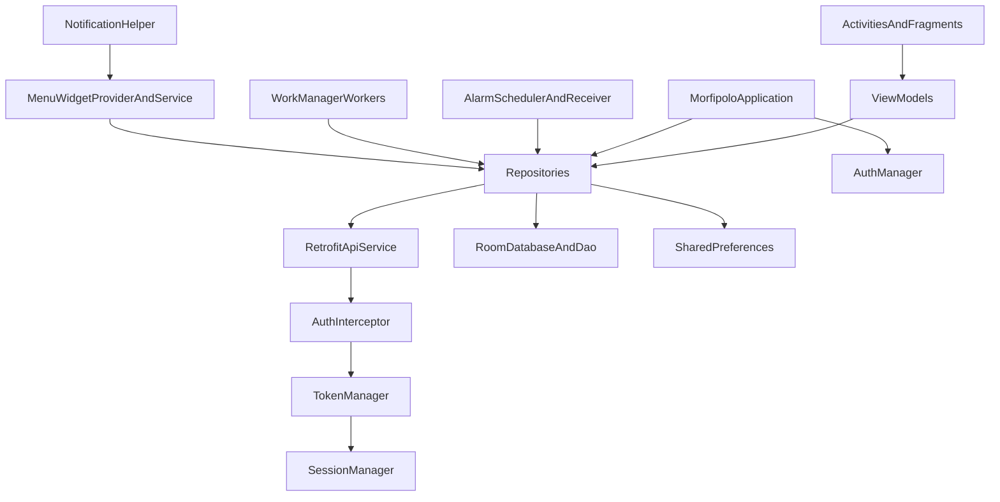

# 03 - Architecture

## Arquitectura real detectada
- **CONFIRMADO POR CÓDIGO**: MVVM manual con repositorios, sin framework DI.
- **CONFIRMADO POR CÓDIGO**: service locator central en `MorfipoloApplication` (instancia DB, managers, repos y API service).
- **INFERIDO POR ESTRUCTURA**: arquitectura pragmática orientada a entrega, con reglas de negocio distribuidas entre ViewModels, adapters y utilitarios.

## Capas y responsabilidades reales
- **UI (Activities/Fragments + XML)**  
  Renderizado, navegación, listeners, mensajes al usuario, insets, binding de estados.
  - Ejemplos: `LoginActivity.kt`, `DailyMenuFragment.kt`, `WeeklyMenuFragment.kt`.

- **Presentación (ViewModel + StateFlow)**  
  Orquestación de casos de uso, reglas de pantalla, control de loading/error, gating por sesión/horario.
  - Ejemplos: `DailyMenuViewModel.kt`, `WeeklyMenuViewModel.kt`, `ProfileViewModel.kt`.

- **Data/Repositorio**  
  Llamadas API, fallback a local, mapeo entidad-modelo, normalización de errores.
  - Ejemplos: `MenuRepository.kt`, `VoteRepository.kt`, `UserRepository.kt`.

- **Remote**  
  Contratos HTTP, auth interceptor, refresh token, base URL.
  - Ejemplos: `MorfiPoloApiService.kt`, `AuthInterceptor.kt`, `TokenManager.kt`, `RetrofitClient.kt`.

- **Local**  
  Room y preferencias (sesión, alarmas, notificaciones).
  - Ejemplos: `AppDatabase.kt`, `MenuDao.kt`, `SessionManager.kt`, `AlarmPreferences.kt`.

- **Background/OS integration**  
  Workers, alarmas exactas, broadcast receivers, widget.
  - Ejemplos: `AlarmScheduler.kt`, `AlarmReceiver.kt`, `DailyReminderWorker.kt`, `MenuWidgetProvider.kt`.

## Flujo de dependencias
- **CONFIRMADO POR CÓDIGO**:
  - UI -> ViewModel -> Repository -> (Remote API + Local DB/Prefs).
  - `Application` inyecta dependencias por factories manuales en cada pantalla.
  - Interceptor de red depende de `TokenManager`; `TokenManager` depende de `SessionManager` y endpoint refresh.

## Patrones y acoplamientos observados
- **Patrones fuertes**
  - Estados sellados `Loading/Success/Error`.
  - Reintentos/fallback local en repositorios.
  - Broadcast interno `MENU_UPDATED` para sincronizar app y widget.
- **Acoplamientos fuertes**
  - Reglas de horario (08:00-11:00) repetidas en múltiples capas (`DailyMenuViewModel`, `WeeklyMenuAdapter`, `MenuWidgetService`).
  - Dependencia cruzada UI <-> lógica de negocio en adapters y fragments.
  - Alta dependencia del comportamiento real del backend de votos (workarounds).

## Qué está bien resuelto
- **CONFIRMADO POR CÓDIGO**:
  - Estrategia de sesión con refresh y distinción entre error temporal vs sesión expirada.
  - Fallback de menús a Room en ausencia de red/error.
  - Reprogramación de alarmas al reinicio del dispositivo.
  - Integración de navegación consistente entre menú diario/semanal/perfil.

## Qué está mezclado o contaminado
- **CONFIRMADO POR CÓDIGO**:
  - Reglas de negocio incrustadas en UI/adapters (no centralizadas).
  - Lógica de sincronización y resiliencia repartida en demasiados puntos.
  - Exceso de logging operacional en widget/notificaciones.
- **INFERIDO POR ESTRUCTURA**:
  - Falta una capa de casos de uso para aislar lógica de negocio compleja.

## Arquitectura teórica vs real
- **Teórica (documentación/comentarios)**: MVVM limpio.
- **Real (código ejecutable)**: MVVM pragmático con lógica de negocio distribuida, service locator manual y parches de robustez.
- **Conclusión**: para continuidad, la fuente de verdad es la arquitectura real implementada.

## Diagrama de dependencias (real)

